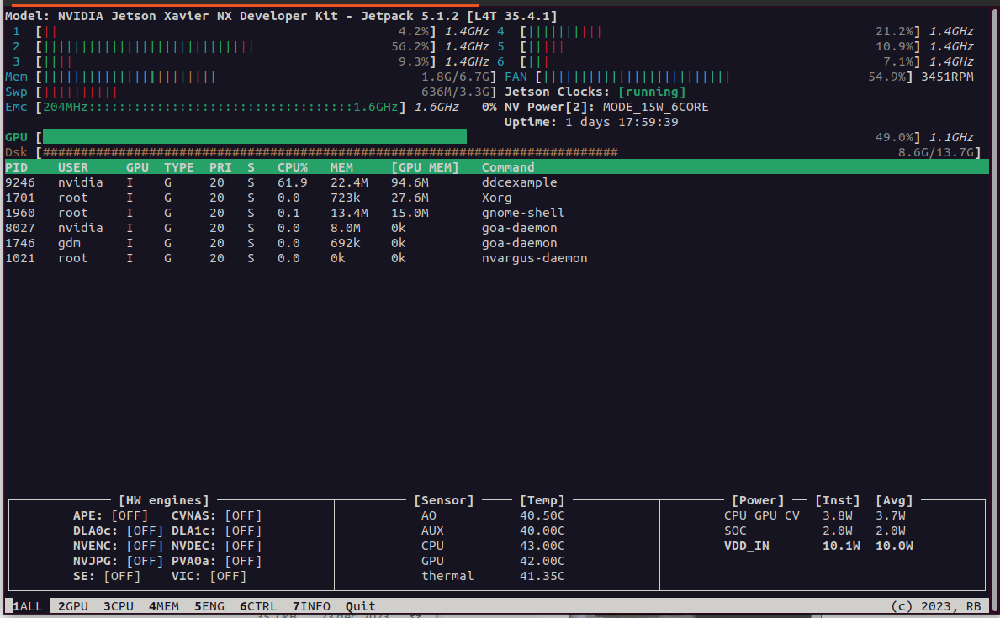
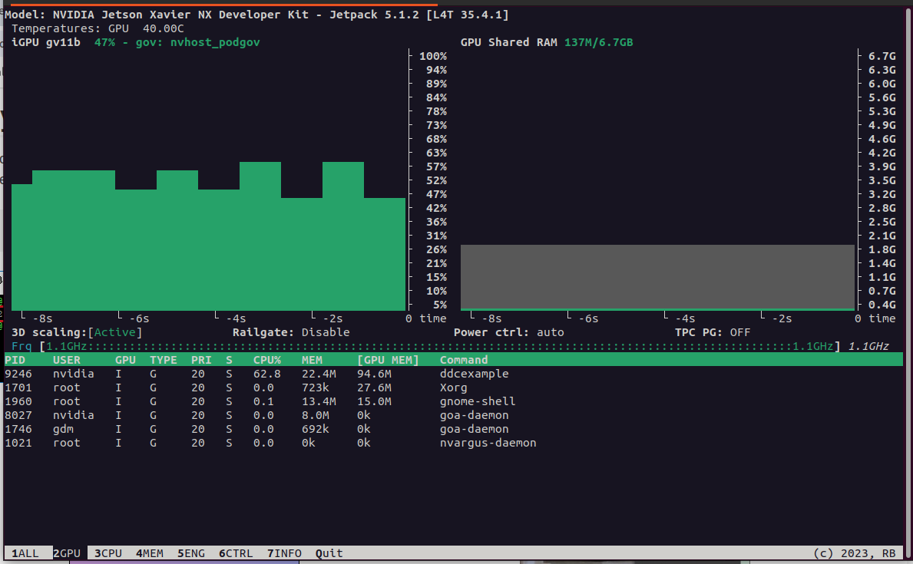
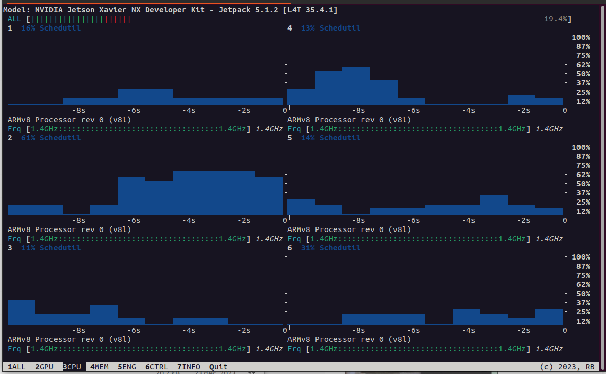

# libgkr4gpu

A CUDA C++ Lib to run multiple independent DDC, originally designed for the Jetson family.

- Developped to extract multiple sub-bands from an incoming SDR continuous stream. 
- This library works on embedded GPU (Jetson family) and also on Desktop PC.

Key features:

- Thread safe
- Supports **ONLY** int ratios: output rate / input rate MUST be an integer
- Supports oversampling in the output stream (typically for digital mode decoding)
- Dynamic add/remove/start/stop for the DDC channels
- Includes a "filter cache" to avoid to recompute taps when multiple channels share the same config

It is a simplified version of the code included in the [SDR-Technologies SDRVM](https://www.sdrtechnologies.fr/products/sdr-virtual-machine/).

This library has been presented during the **FOSDEM 2024**.

Please note that this library is (c) Sylvain AZARIAN (F4GKR) and is released under the *GNU General Public License v3.0*. If you need to reuse this code for specific purposes, please contact me.

## Benchmark with the example app

|CPU|GPU|1 channel|2 channels|
|---|---|---|--|
|ntel® Core™ i7-9700K CPU @ 3.60GHz × 8| GeForce RTX2060| **608** Mega samples/sec |  **530** Mega samples/sec |
|Jetson Xavier NX| Jetson | **156** Mega samples/sec |  **117** Mega samples/sec |

On the Xavier NX :



There is room for improvement as the GPU is not 100% loaded ;-)





## Example app

The [example](example.cpp) application works as follows :

- We simulate a source providing blocks of 256k complex samples, sampled at 100 MHz
- We want two output streams :
  - first one is 2 MHz wide, centered at +25 MHz
  - seconde one is 5 MHz wide, centered at -10 MHz
- Every 200 cycles, the app turns on/off Channel 1
- Every 200 cycles, the app changes the center frequency of channel 2

To compile & enjoy :

``` bash
mkdir build
cd build
cmake ../ 
```

If you have :

``` bash
-- The CUDA compiler identification is unknown
CMake Error at CMakeLists.txt:58 (enable_language):
  The CMAKE_CUDA_COMPILER:

    nvcc

  is not a full path and was not found in the PATH.

  Tell CMake where to find the compiler by setting either the environment
  variable "CUDACXX" or the CMake cache entry CMAKE_CUDA_COMPILER to the full
  path to the compiler, or to the compiler name if it is in the PATH.
```

Make sure you have nvcc in your path.

On Jetson Xavier NX:

``` bash
nvidia:/data/sources/libgkr4gpu/build$ cmake ../
-- CMake Script (c) Sylvain AZARIAN - F4GKR
-- Architecture: aarch64
-- Testing native support for compiler
-- Native compile !
-- The CUDA compiler identification is NVIDIA 11.4.315
-- Check for working CUDA compiler: /usr/local/cuda-11.4/bin/nvcc
-- Check for working CUDA compiler: /usr/local/cuda-11.4/bin/nvcc -- works
-- Detecting CUDA compiler ABI info
-- Detecting CUDA compiler ABI info - done
-- Configuring done
-- Generating done
```

## Lib "how to"

We start by creating a DDCBank object with a max of NDDC_CHANNELS. We have also to specify :

- the FFT size we will use, here a 512x1024 bins FFT Size
- the maximum input size will be 512x1024 samples 

``` c++
 DDCBank* ddcbank = new DDCBank( 100e6, NDDC_CHANNELS, 512*1024, 512*1024 );
```

Then we add our channels, only two in this example.

``` c++
    // First channel : 2MHz wide +25 MHz
    int channel1 = ddcbank->allocChannel( 2e6 );
    ddcbank->setCenterOfWindow( channel1, 25e6 );
    ddcbank->enterActiveState( channel1); // this channel is enabled

    // Second channel: 5MHz de large at -10 MHz
    int channel2 = ddcbank->allocChannel( 5e6 );
    ddcbank->setCenterOfWindow( channel2, -10e6 );
    ddcbank->enterActiveState( channel2); // this channel is enabled
```

Now the core of the API :

- We inject a new bunch of samples in the DDC. Depending on the configured FFT size and existing data, we may not have yet enough samples to run the GPU horses. The **put()** method will return a flag accordingly. We can have the following situation :

|Constant|Value|Meaning|
|---|---|---|
| INPUT_TOO_LONG | -1 | The added IQ block is too long and does not fit in the allocated memory when the DDCBank() constructor was called |
| NEED_MORE_DATA | -2 | We do not have yet enough data for the DDC to run - this is not an error |
| NO_FEEDER | -3 | No channel is enabled, nothing to do |
| GET_DATA_OUT | 1 | The DDC has run (on the GPU) and samples are available for at least one of the output channels |


``` c++
    // inject data into the DDC
         int rc = ddcbank->put( in );

         if( rc == NO_FEEDER ) {
             fprintf( stderr, "No active channel, data ignored\n");
             fflush( stderr );
             continue ;
         }
         if( rc == INPUT_TOO_LONG ) {
             fprintf( stderr, "Read outputs first !!! too many data waiting\n");
             fflush( stderr );
             continue ;
         }

         if( rc == NEED_MORE_DATA ) {
             // the input buffer is not full yet, nothing processed at this stage
             continue ;
         }
```

- The exact number of samples added to the active channels in a function of the FFT size and the (input sample rate)/(output sample rate) ratio.
- One can retrieve the outputs via the **get** method, returning a CF32Block structure. Note that a *CF32BlockAlloc* alloc function is included in [datatypes.h](src/datatypes.h). This function returns **aligned alloc**.

``` c++
typedef struct {
    CF32 *data ;            // pointer to the IQ samples
    uint32_t length ;       // the effective number of samples
    uint32_t buff_length ;  // the lenght of allocated region to store samples. buff_length >= length
    int64_t center_freq ;   // This is the offset of the channel
    uint64_t samplerate ;   // This is the sample rate of the channel
    uint8_t oversampling;   // oversampling factor 
} CF32Block ;

```

- We now iterate and extract data

``` c++
         // Check if we have some outputs ready
         for( int c=0 ; c < NDDC_CHANNELS ; c++ ) {
              if( ddcbank->hasData( c, -1 ) ) {
                  // Data available here
                  CF32Block *output = ddcbank->get( c );
                  //fprintf( stdout, "Channel %d - %ld samples available\n", c, (long)output->length );
                  //fflush( stdout );
                  CF32BlockFree(output);
              }
         }
```

## Tricks in the code - touch only if you know what you are doing

- You can change the default TAPS number, currently 7200 (!). This is defined in [olasgpuchannel.cpp line 21](src/olasgpuchannel.cpp)
- The filter is computed in the time domain and then transformed to frequency domain using the CUDA Cufft functions. You may want to replace this with FFTW or other implementation, but **make sure you use a thread safe lib** (fftw plan is not thread safe)
- Some additional code is provided in the cuda "zero.cu" file... to be documented later.

